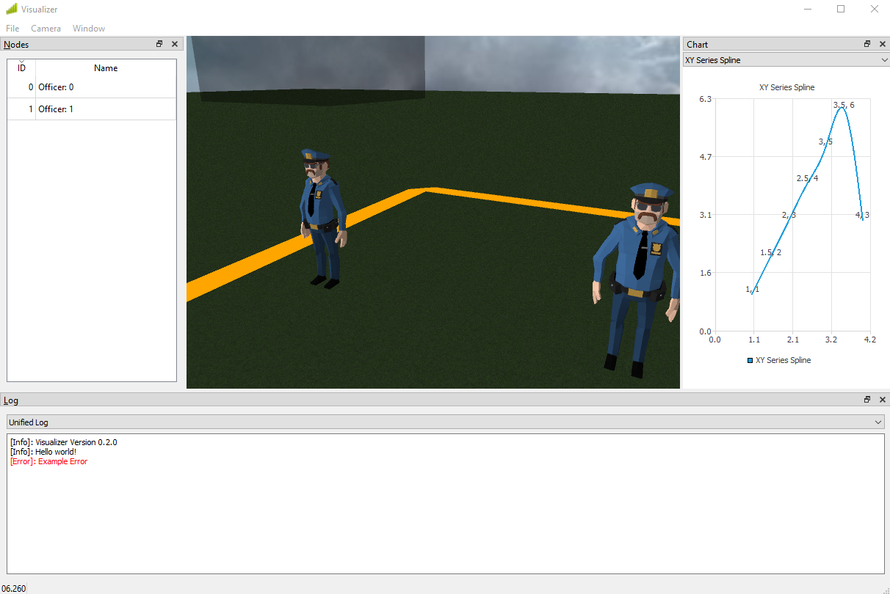

# NetSimulyzer ns-3 Module
A flexible 3D visualizer for displaying, debugging, presenting, and understanding *ns-3* scenarios.




# Table of Contents

* [About](#about)
* [Requirements](#requirements)
* [Installation](#installation)
    * [Clone (Recommended)](#clone-recommended)
    * [Download ZIP](#download-zip)
    * [Connecting the Module Quickly](#connecting-the-module-quickly)
    * [Connecting the Module Safely](#connecting-the-module-safely)
        * [Waf (Linking)](#waf-linking)
        * [Code](#code)
  * [Updating](#updating)
    * [Clone](#clone)
    * [ZIP](#zip)
* [Documentation](#documentation)
  * [Building the Documentation](#building-the-documentation)
* [Running the Examples](#running-the-examples)
  * [Application State Trace Example](#application-state-trace-example)
  * [Lena Radio Link Failure](#lena-radio-link-failure)
  * [Mobility Buildings Example](#mobility-buildings-example)
  * [WiFi Bianchi](#wifi-bianchi)
  * [Outdoor Random Walk](#outdoor-random-walk)
* [Feature Overview](#feature-overview)
  * [Showing Nodes](#showing-nodes)
  * [Showing Buildings](#showing-buildings)
  * [Decorations](#decorations)
  * [Areas](#areas)
  * [Log Streams](#log-streams)
  * [Series](#series)


# About
This is the [ns-3](https://www.nsnam.org/) companion module the
[NetSimulyzer](https://github.com/usnistgov/NetSimulyzer).
Link this module & run your scenario to see it in 3D.

# Requirements
* A C++ 17 compliant compiler
    * Minimum supported compilers:
        * GCC 7.3.0
        * Clang 6.0.0

# Installation
## Clone (Recommended)
Clone the project into a directory called `netsimulyzer` in
the `src` or `contrib` directory of a supported version of ns-3

1) `cd` into the `src` or `contrib` directory of `ns-3`

```shell
# If using src/
cd src/

# If using contrib/
cd contrib/
```

2) Clone the project from one of the below URLs
```shell
# Pick one of the below
# HTTPS (Choose this one if you're uncertain)
git clone https://github.com/usnistgov/NetSimulyzer-ns3-module netsimulyzer

# SSH
git clone git@github.com:usnistgov/NetSimulyzer-ns3-module.git netsimulyzer
```

3) (Re)configure & (Re)build `ns-3`
```shell
# --enable-examples is optional, see `Running the Examples`
# for how to run them
./waf configure --enable-examples
./waf
```

## Download ZIP
If, for whatever reason, `git` is not available, download the
project & unzip it into the `src` or `contrib` directory of `ns-3`.

Note that updates will have to be performed manually using this method

1) Download the ZIP of the project from the url below:

https://github.com/usnistgov/NetSimulyzer-ns3-module/archive/master.zip

2) Unzip the file into the `ns-3` `src/` directory
```shell
unzip NetSimulyzer-ns3-module-master.zip
```

3) Rename the resulting directory to `netsimulyzer`, as ns-3 will not accept a module named differently
than its directory.
```shell
mv NetSimulyzer-ns3-module-master netsimulyzer
```

## Connecting the Module Quickly
If you are linking your module/program to the `netsimulyzer` module add the following to your `wscript`

```python
# Program
obj = bld.create_ns3_program('program-name', ['netsimulyzer', '''...'''])


# Module
module = bld.create_ns3_module('module-name', ['netsimulyzer', '''...'''])
```

You may now include & use the `netsimulyzer` module in code:
```cpp
#include <ns3/netsimulyzer-module.h>
//...

int main ()
{
    // ...
    auto orchestrator = CreateObject<netsimulyzer::Orchestrator> ("example.json");
    // ...
}
```

## Connecting the Module Safely
You may wish for your module to not have a hard dependency on the `netsimulyzer` module.
The following steps will allow you to link the module & still allow your code to build &
run without the module being present.

### Waf (Linking)
If you wish for your module/program to be able to build without the `netsimulyzer` module
you may check for it's existence by reading `bld.env['HAS_NETSIMULYZER']` in your `wscript`. See below:

```python
def build(bld):
    # Create a list of your required modules to link
    # 'core' & 'mobility' are just examples here
    linked_modules = ['core', 'mobility']

    # Check if 'HAS_NETSIMULYZER' was defined during configuration
    if 'HAS_NETSIMULYZER' in bld.env:
        # If it was defined, then the 'netsimulyzer' is present and we may link it
        linked_modules.append('netsimulyzer')

    # Be sure to pass your list of `linked_modules` to `create_ns3_program`
    # or `create_ns3_module`
    obj = bld.create_ns3_program('application-name', linked_modules)
```

### Code
In addition to the variable in the build environment, the module also defines a C++ macro
also named `HAS_NETSIMULYZER`. This macro may be used in C++ code to check for the presence
of the `netsimulyzer` module.

See the below code sample:
```cpp
// Guard the include with the macro
#ifdef HAS_NETSIMULYZER
#include <ns3/netsimulyzer-module.h>
#endif

// ...

int main ()
{
    // ...

    // Guard any NetSimulyzer references in code with the macro as well
#ifdef HAS_NETSIMULYZER
    auto orchestrator = CreateObject<netsimulyzer::Orchestrator> ("example.json");
    // ...
#endif
}
```

## Updating
### Clone
To update the cloned module, move to the module's root directory and perform a `git pull`
```shell
# From the ns-3 root
cd src/netsimulyzer
git pull
```

### ZIP
To update a ZIP installation, remove the old module and replace it with the updated one.

```shell
# From the ns-3 root
cd src
rm -Rf netsimulyzer

#use this command, or download manually
wget https://github.com/eeibevan/omxplaylist/archive/master.zip -O NetSimulyzer-ns3-module-master.zip
unzip NetSimulyzer-ns3-module-master.zip

# Make sure the directory in the ns-3 src/ directory is
# named `netsimulyzer`
mv NetSimulyzer-ns3-module-master netsimulyzer


```

# Documentation
For prebuilt versions of the documentation, see the
[Releases page on GitHub](https://github.com/usnistgov/NetSimulyzer-ns3-module/releases).

## Building the Documentation
[Sphinx](https://www.sphinx-doc.org/en/master/) is required to build the documentation.

To run Sphinx to build the documentation, cd into the `doc` directory in the module
and run `make [type]` for the type of documentation you wish to build.

```shell
# From the ns-3 root directory
cd src/netsimulyzer/doc

# HTML (Several Pages)
make html

# HTML (One Page)
make singlehtml

# PDF
make latexpdf

# To list other options, just run make
make
```

The built documentation will now be found in `doc/build/[type]`.


# Running the Examples
Listed below are the commands to run the examples provided with the
module:

## Application State Trace Example
Example demonstrating tracing the state of a custom `ns3::Application` using the `StateTransitionSink`.
```shell
waf --run application-state-trace-example-netsimulyzer
```

## Lena Radio Link Failure
An adaptation of the 'lena-radio-link-failure' example from the `LTE` module with statistics
tied into the NetSimulyzer
```shell
./waf --run "lena-radio-link-failure-netsimulyzer --simTime=20 --numberOfEnbs=2 --visual=true"
```

## Mobility Buildings Example
Example demonstrating topology/mobility output to the NetSimulyzer
```shell
waf --run mobility-buildings-example-netsimulyzer
```

## Throughput Sink Example
Example demonstrating how to connect the `netsimulyzer::ThroughputSink`
to the UDP Echo Client & Server applications to graph throughput.
```shell
waf --run throughput-sink-example-netsimulyzer
```

## WiFi Bianchi
The WiFi Bianchi example from the `wifi` module with topology, logs, and several statistics.
```shell
./waf --run "wifi-bianchi-netsimulyzer --trials=1 --nMinStas=10 --nMaxStas=10 --visual=true"
```

## Outdoor Random Walk
A simple example from the `buildings` module demonstrating integration into an existing scenario
```shell
waf --run outdoor-random-walk-example-netsimulyzer
```

# Feature Overview

## Showing Nodes
Create a `NodeConfigurationHelper`, set a model for the Nodes and `Install()`
on the Nodes you wish to be displayed in the application.

```c++
using namespace ns3;

netsimulyzer::NodeConfigurationHelper nodeHelper{orchestrator};
nodeHelper.Set ("Model", netsimulyzer::models::SMARTPHONE_VALUE);

// Shows every Node in the scenario
for (auto node = NodeList::Begin (); node != NodeList::End (); node++)
    nodeHelper.Install (*node);

// Or install on a container
NodeContainer containerNodes;
containerNodes.Create (2);
nodeHelper.Install (containerNodes);
```

## Showing Buildings
Buildings have a similar setup to Nodes, only there is no requirement for a model.

```c++
using namespace ns3;

// Show every building in the scenario
netsimulyzer::BuildingConfigurationHelper buildingHelper{orchestrator};
for (auto building = BuildingList::Begin (); building != BuildingList::End (); building++)
    buildingHelper.Install (*building);
```

## Decorations
For purely visual elements add a `Decoration`. A Decoration`
is similar to a `NodeConfiguration` except its position is set manually.

```c++
auto decoration = CreateObject<netsimulyzer::Decoration>(orchestrator);
decoration.SetAttribute ("Model", netsimulyzer::models::CELL_TOWER_POLE_VALUE);
decoration.SetPosition ({5.0, 5.0, 0.0});
```

## Areas
To draw attention to certain areas in the topology, it may be defined as an area.
A `RectangularArea` will draw a rectangle with a border at some defined coordinates

```c++
  // ns-3 Rectangle from the Mobility Model
  // 5x5 area around the origin
Rectangle start{-5.0, 5.0, -5.0, 5.0};
auto startingArea = CreateObject<netsimulyzer::RectangularArea>(orchestrator, start);

// Optional (Default: Black)
startingArea->SetAttribute ("BorderColor", GREEN_VALUE);

// The Rectangle may be constructed in place as well
auto finishingArea = CreateObject<netsimulyzer::RectangularArea>(orchestrator, Rectangle{10.0, 7.0, 10.0, 7.0});
finishingArea->SetAttribute ("BorderColor", RED_VALUE);
```

## Log Streams
A `LogStream` may be used to output messages at a given time during the scenario.
A `LogStream` works similar to a C++ stream (e.g. `std::cout`).

```c++
auto infoLog = CreateObject<netsimulyzer::LogStream> (orchestrator);

// Optional, but highly recommended you set a name for each stream
infoLog->SetAttribute ("Name", StringValue ("Info"));

// Use like std::cout
// Note the * at the beginning
// and '\n' at the end of the message
*infoLog << "Hello "
         << "world!\n";

int number = 5;
*infoLog << "Logs convert numbers to strings for you\n"
         << "See: " << number << '\n';
```

## Series
A series is a collection of points which may be displayed
on a chart in the application.

A series may be added to as the scenario runs and points
are added at the same time during playback as they were added in
the simulation.

There are several types of series, but the simplest is the `XYSeries` shown below.
For the other series types, refer to the documentation.

```c++
auto xy = CreateObject<netsimulyzer::XYSeries> (orchestrator);

// Optional, but highly recommended
xy->SetAttribute ("Name", StringValue ("XY Series Example"));

// Default is `Line` (line graph),
// there is also `None` (scatter plot)
// and `Spline` (spline graph)
xy->SetAttribute ("Connection", EnumValue (netsimulyzer::XYSeries::Line));

// Points are added through `Append (x, y)` calls,
// and may occur at any time
// before or during the simulation
xy->Append (1.0, 1.0);
```
