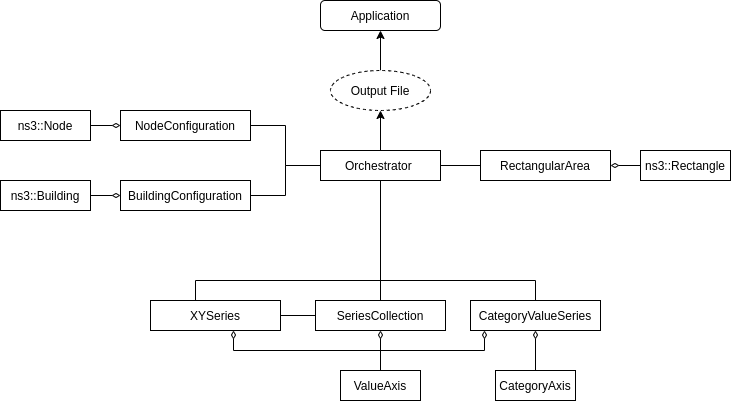

Architecture
============

Events
------

Every change that occurs during the scenario (e.g. a ``ns3::Node`` moving, or a stream being appended to)
is passed around the module as an 'event'. Events are produced by models and processed by
an :doc:`orchestrator`.

Events are replayed in the application at the time they occurred in the scenario. Even
if they occurred before ``Simulation::Start()``, where they will be applied as soon as
playback begins. No events will be captured after the simulation ends (after ``Simulation:::Stop()``).

Events are typically not exposed to module users.

The Orchestrator
----------------

The :doc:`orchestrator` manages module features, output, and receives information
from each of the models. As a consequence, every model in some way connects back
to an :doc:`orchestrator`.

By design, a scenario may support more than one :doc:`orchestrator`, although a
``ns3::Node`` or ``ns3::Building`` may be configured to only one since
*ns-3* only allows one object per type to be aggregated onto a given item.

Configuration Models
--------------------

For integrating with items from *ns-3* the module supplies additional
models to be aggregated onto their corresponding *ns-3* components.
(e.g. :ref:`node-configuration` would be aggregated onto a ``ns3::Node``)
These models allow for module specific configuration of these *ns-3* items,
such as what 3D model to display for a ``ns3::Node``, or what color to display
a ``ns3::Building``. The models also collect information about their *ns-3* counterparts
for display, such as position.

For more information on these models, see their corresponding pages below:

* :doc:`nodes`
* :doc:`buildings`

Decorations
------------

Decorations provide similar configuration options as a :ref:`node-configuration`, and
provides a similar list of possible events to the :doc:`orchestrator`.

Decorations do not affect the scenario and exist purely for visual purposes.

For more information, See: :doc:`decorations`

Series and Axes
---------------

Series do not directly interface with *ns-3*, but instead rely on users and additional
helpers to supply information. That information is then packaged and sent to the :doc:`orchestrator`
and processed as an event, much like a Node moving.

Axes are created with series, and are only accessed to configure display properties for the application
such as the minimum and maximum values, or the label.

For more information on series and axes, see: :doc:`series`

Log Streams
-----------

Log Streams package messages from users or helpers as events and pass them
to an :doc:`orchestrator`. Log Streams convert some items to strings, but otherwise
do not transform any provided data.

Areas
-----

Areas provide their boundaries and configuration at the beginning of
the scenario to the :doc:`orchestrator`, but otherwise do not
contribute data or events during the scenario.
