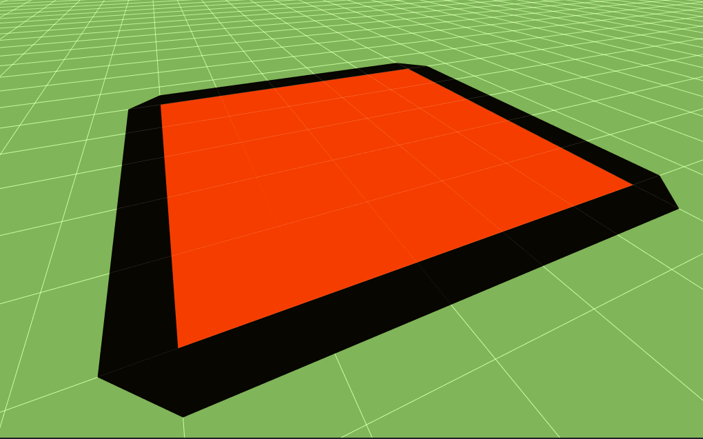
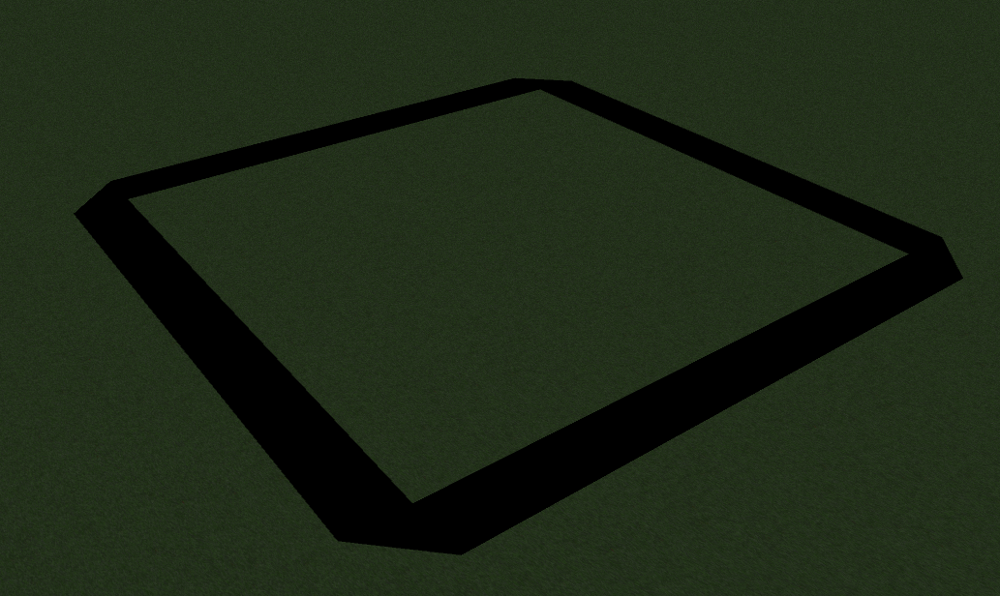
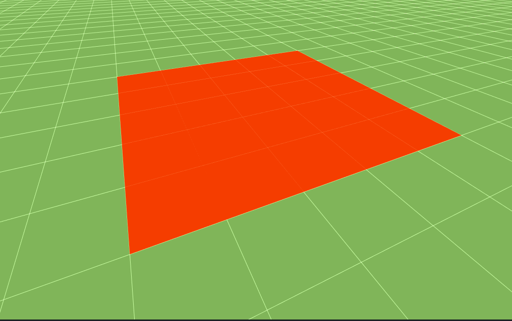

Areas
=====

In order to mark important locations in the scenario use a ``RectangularArea``

.. _rectangular-area:

RectangularArea
---------------

A ``RectangularArea`` defines an area defined by a ``ns3::Rectangle`` to
be displayed in the application.

A ``RectangularArea`` may have a border, a fill, or both.

The 'fill' or body of a ``RectangularArea`` extends over the entirety of
the bounds provided in the constructor, or to the ``Bounds`` attribute.
The border slightly extends beyond these values.

Border and Fill
^^^^^^^^^^^^^^^

Border
^^^^^^

Fill
^^^^

Attributes
^^^^^^^^^^

+----------------------+---------------+-------------------+---------------------------------------------------+
| Name                 | Type          | Default Value     | Description                                       |
+======================+===============+===================+===================+===============================+
| Name                 | string        | n/a               | Name to use for this area in application elements |
+----------------------+---------------+-------------------+---------------------------------------------------+
| Bounds               | Rectangle     | n/a               | Boundaries for the fill of the area               |
|                      |               |                   |                                                   |
+----------------------+---------------+-------------------+---------------------------------------------------+
| Border               | DrawMode      | Solid             | Method of displaying the border                   |
|                      |               |                   |                                                   |
|                      |               |                   | * ``Solid`` (Default) display as a solid color    |
|                      |               |                   | * ``Hidden`` do not display a border              |
+----------------------+---------------+-------------------+---------------------------------------------------+
| Fill                 | DrawMode      | Solid             | Method of displaying the fill                     |
|                      |               |                   |                                                   |
|                      |               |                   | * ``Solid`` (Default) display as a solid color    |
|                      |               |                   | * ``Hidden`` do not display a fill                |
+----------------------+---------------+-------------------+---------------------------------------------------+
| Height               | double        | 0.0               | Z level to display the area.                      |
+----------------------+---------------+-------------------+---------------------------------------------------+
| FillColor            | :ref:`color3` | Light Gray (204u) | Color of the area within the border               |
+----------------------+---------------+-------------------+---------------------------------------------------+
| BorderColor          | :ref:`color3` | Black (0u)        | Color of the border surrounding the fill          |
+----------------------+---------------+-------------------+---------------------------------------------------+

