Showing Nodes
=============

To show a ``ns3::Node`` in the application aggregate a ``NodeConfiguration`` onto
it, and define a ``Model`` to use to represent the ``ns3::Node``.

.. _node-configuration:

NodeConfiguration
-----------------

A ``NodeConfiguration`` is used to determine if a ``ns3::Node`` in the scenario
should be displayed in the application. If a ``NodeConfiguration`` was installed on a ``ns3::Node``
then that ``ns3::Node`` will be tracked and shown during playback.

The basic setup for a ``NodeConfiguration`` is as follows:

.. code-block:: C++

  netsimulyzer::NodeConfigurationHelper nodeHelper{/* the orchestrator */};

  // Assigns the smartphone model
  // see `netsimulyzer-3d-models.h` for the others
  // Or provide a path to a custom one
  nodeHelper.SetAttribute ("Model", netsimulyzer::models::SMARTPHONE_VALUE);

  nodeHelper.Install (/* Ptr or Collection */)

Model Constants
^^^^^^^^^^^^^^^

Constants representing the models bundled with the application are provided
with the module in ``netsimulyzer-3d-models.h`` under the ``models`` namespace.

Each constant is presented with a ``std::string`` and ``ns3::StringValue`` option
to simplify setting attribute values.

Below are the provided values and their respective models

.. The images make this section a bit unwieldy, so exert some extra control over the pages
.. raw:: latex

    \clearpage

Smartphone
++++++++++

* ``std::string`` Constant: ``SMARTPHONE``
* ``ns3::StringValue`` Constant: ``SMARTPHONE_VALUE``

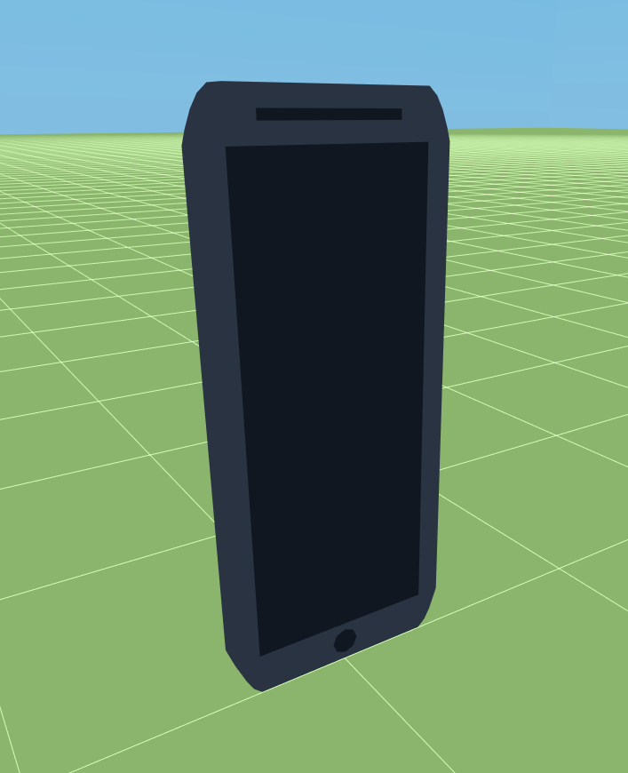

.. raw:: latex

    \clearpage

Land Drone
++++++++++
* ``std::string`` Constant: ``LAND_DRONE``
* ``ns3::StringValue`` Constant: ``LAND_DRONE_VALUE``

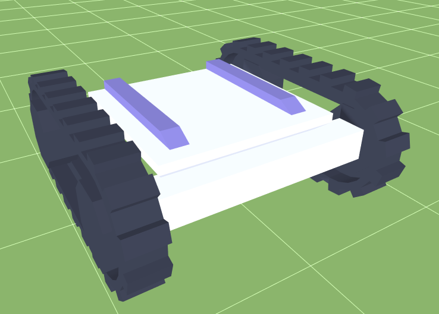

Server
++++++
* ``std::string`` Constant: ``SERVER``
* ``ns3::StringValue`` Constant: ``SERVER_VALUE``

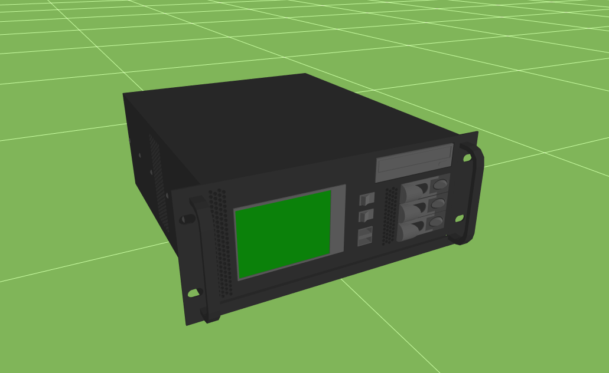

Cell Tower Pole
+++++++++++++++
This model only has a ``BaseColor``, any
``HighlightColor`` set for this model will be ignored.

* ``std::string`` Constant: ``CELL_TOWER_POLE``
* ``ns3::StringValue`` Constant: ``CELL_TOWER_POLE_VALUE``

.. image:: _static/cell-tower-pole-model.png
  :alt: The cell_tower_pole.obj model with default colors
  :width: 330px
  :height: 341px

.. raw:: latex

    \clearpage

Cell Tower
++++++++++
* ``std::string`` Constant: ``CELL_TOWER``
* ``ns3::StringValue`` Constant: ``CELL_TOWER_VALUE``

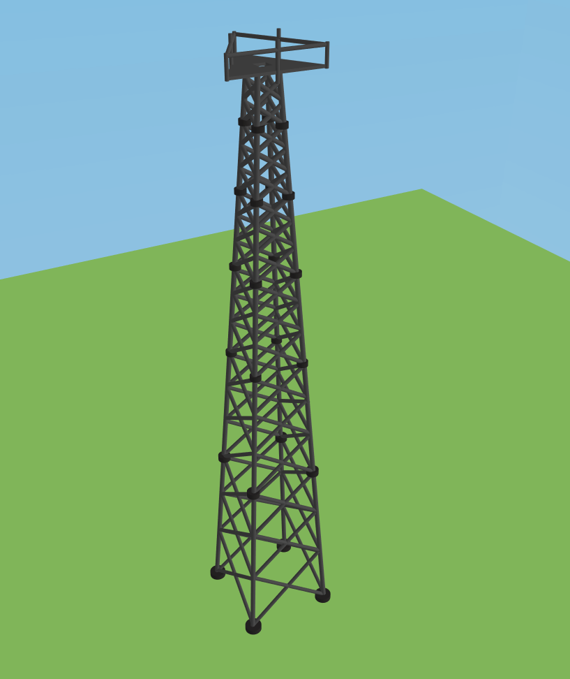

.. raw:: latex

    \clearpage

Quadcopter UAV
++++++++++++++
* ``std::string`` Constant: ``QUADCOPTER_UAV``
* ``ns3::StringValue`` Constant: ``QUADCOPTER_UAV_VALUE``

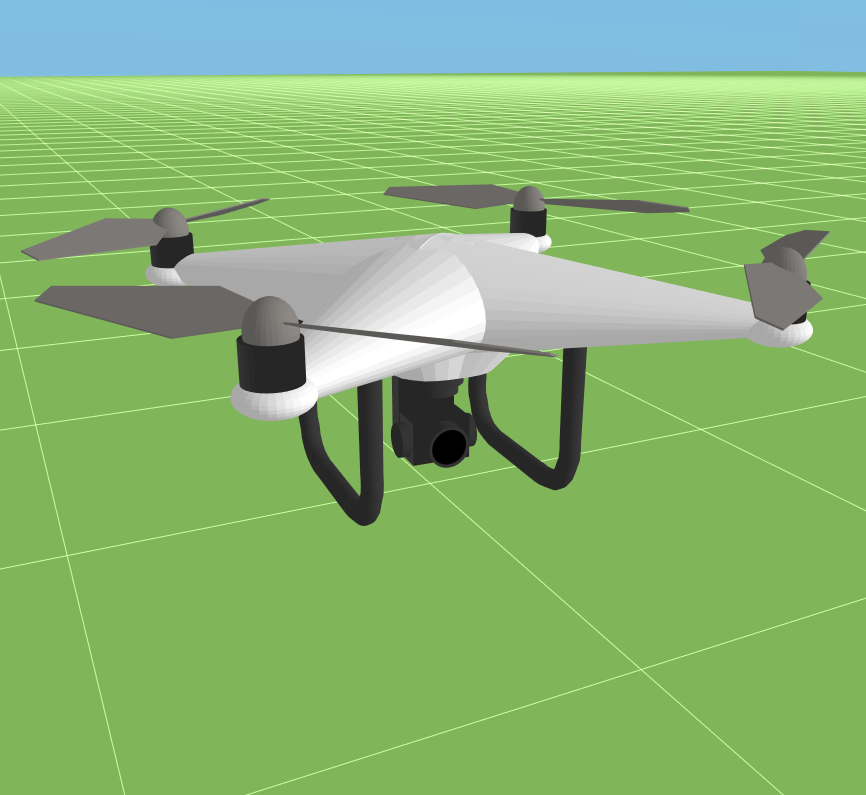

.. raw:: latex

    \clearpage

Car
+++
* ``std::string`` Constant: ``CAR``
* ``ns3::StringValue`` Constant: ``CAR_VALUE``

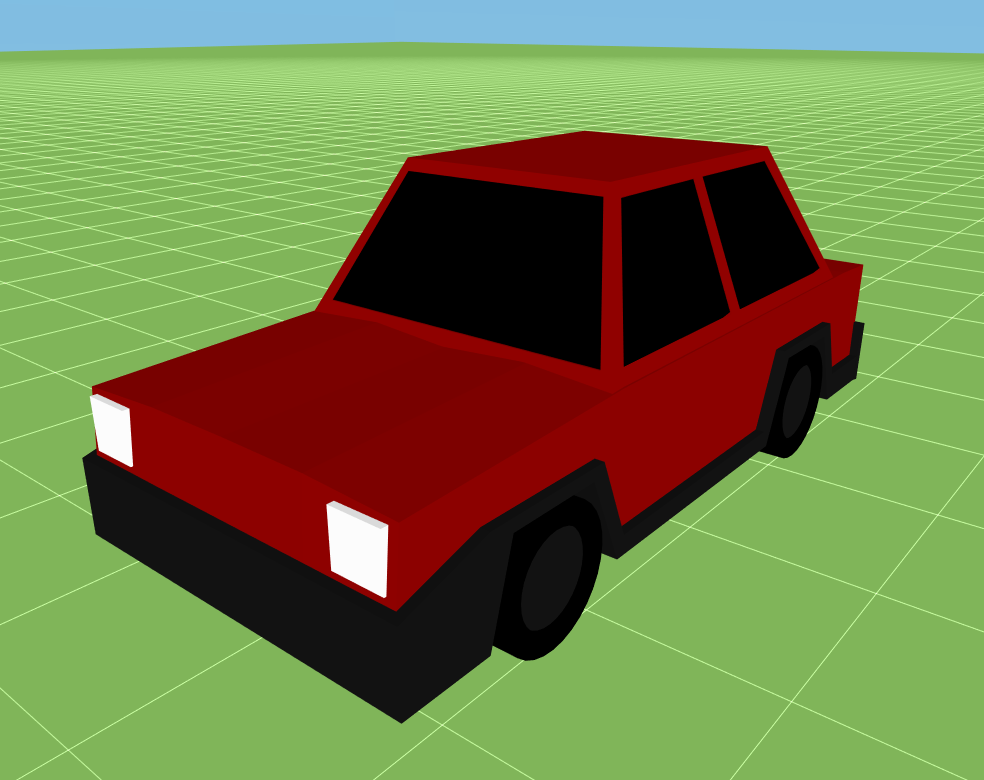

.. raw:: latex

    \clearpage

Router
++++++
* ``std::string`` Constant: ``ROUTER``
* ``ns3::StringValue`` Constant: ``ROUTER_VALUE``

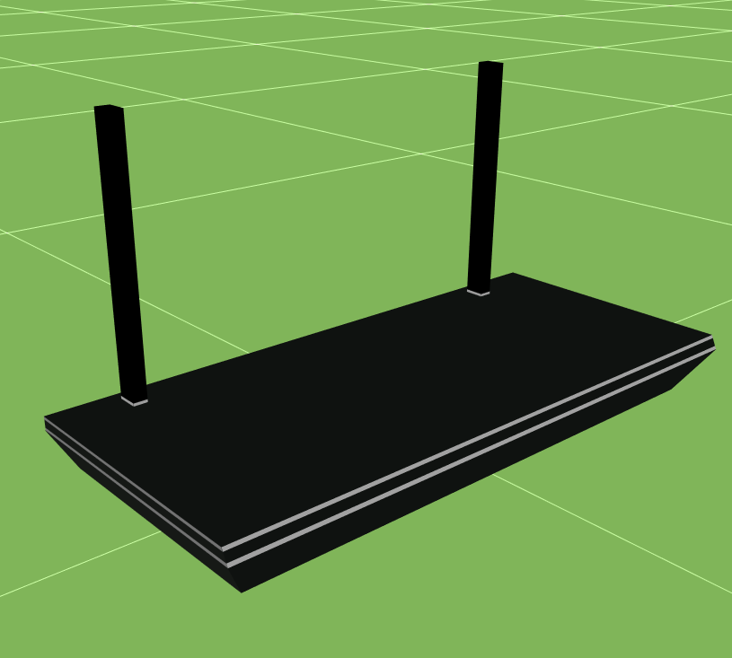

.. raw:: latex

    \clearpage

Cube
++++
This model only has a ``BaseColor``, any
``HighlightColor`` set for this model will be ignored.

* ``std::string`` Constant: ``CUBE``
* ``ns3::StringValue`` Constant: ``CUBE_VALUE``

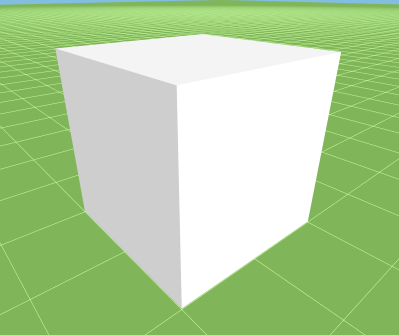

.. raw:: latex

    \clearpage

Diamond
+++++++
This model only has a ``BaseColor``, any
``HighlightColor`` set for this model will be ignored.

* ``std::string`` Constant: ``DIAMOND``
* ``ns3::StringValue`` Constant: ``DIAMOND_VALUE``

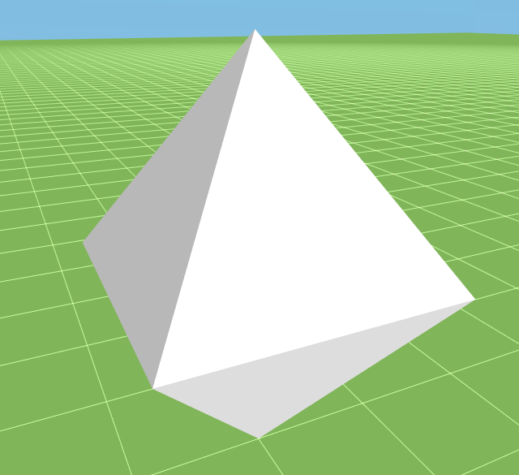

Sphere
++++++
This model only has a ``BaseColor``, any
``HighlightColor`` set for this model will be ignored.

* ``std::string`` Constant: ``SPHERE``
* ``ns3::StringValue`` Constant: ``SPHERE_VALUE``

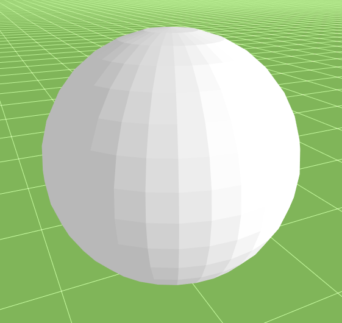

Square Pyramid
+++++++++++++++
This model only has a ``BaseColor``, any
``HighlightColor`` set for this model will be ignored.

* ``std::string`` Constant: ``SQUARE_PYRAMID``
* ``ns3::StringValue`` Constant: ``SQUARE_PYRAMID``

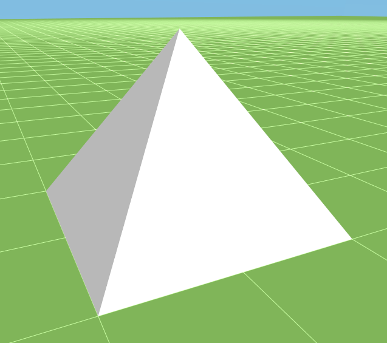

.. raw:: latex

    \clearpage

Configurable Colors
^^^^^^^^^^^^^^^^^^^
Certain models provided with the application allow their colors to be set by the loaded
scenario. Colors may be changed both before and during the simulation, the latter of which will
occur during playback at the time the color was changed, much like a move event.

An example of configurable colors follows using the "Land Drone" model distributed
with the application and displayed with the following code:

.. code-block:: C++

  auto node = CreateObject<Node> ();

  netsimulyzer::NodeConfigurationHelper nodeHelper{/* orchestrator */};
  nodeHelper.Set ("Model", netsimulyzer::models::LAND_DRONE_VALUE);
  nodeHelper.Install (node);

.. image:: _static/reference-land-drone.png
  :alt: Default configuration for land_drone.obj
  :width: 399px
  :height: 263px

Base Color
++++++++++
The ``BaseColor`` is typically the color which occupies the majority of the surface area
of the model. What follows is an example with the "Land Drone"'s ``BaseColor`` set to blue

.. code-block:: C++

  // ...
  nodeHelper.Set ("BaseColor",
    netsimulyzer::OptionalValue<netsimulyzer::Color3>{netsimulyzer::BLUE});
  nodeHelper.Install (node);

.. image:: _static/base-color-land-drone.png
  :alt: Default configuration for land_drone.obj
  :width: 402px
  :height: 264px

Highlight Color
+++++++++++++++
The ``HighlightColor`` is typically the color used to mark details on the model
of the model. What follows is an example with the "Land Drone"'s ``HighlightColor`` set to blue

.. code-block:: C++

  // ...
  nodeHelper.Set ("HighlightColor",
    netsimulyzer::OptionalValue<netsimulyzer::Color3>{netsimulyzer::BLUE});
  nodeHelper.Install (node);

.. image:: _static/highlight-color-land-drone.png
  :alt: Default configuration for land_drone.obj
  :width: 405px
  :height: 261px

Mobility Model Integration
^^^^^^^^^^^^^^^^^^^^^^^^^^

The location of the ``ns3::Node`` is read from whatever Mobility Model is aggregated on the same ``ns3::Node``.
If no Mobility Model is aggregated onto a Node, then it will be displayed at the origin (0, 0, 0).

There are two mechanisms for tracking a Node's location:

.. _location-polling:

Location Polling
++++++++++++++++

If the ``PollMobility`` in the :doc:`orchestrator` is ``true``, then each configured ``ns3::Node`` will be
polled for its location based on the ``MobilityPollInterval``.

If ``UsePositionTolerance`` is ``true`` (the default), then the change in the
position of a ``Node`` must be greater than the start written location plus the
``PositionTolerance`` (default 0.05 ns-3 units) to be written again.

See the :ref:`Orchestrator page on Mobility Polling <orchestrator-mobility-polling>` for more details.

CourseChange Callback
+++++++++++++++++++++

Whenever the aggregated Mobility Model emits a ``CourseChange`` trace
the location of the ``ns3::Node`` is written.

Most models only emit these for significant events, such as velocity change, explicit location change,
etc.

Positions written from a ``CourseChange`` callback are not subject to the ``PositionTolerance``
and will always be written.

Unlike :ref:`orchestrator-mobility-polling`, this location tracing may not be disabled.

Transmission Animations
^^^^^^^^^^^^^^^^^^^^^^^

To visualize wireless transmissions, the ``NodeConfiguration`` class provides the ``Transmit()``
method. The signature for this method is below:

.. cpp:function:: void NodeConfiguration::Transmit (Time duration, double targetSize, Color3 color = GRAY_30)

When called, this displays an expanding sphere in the application. The sphere will expand for ``duration``
and grow to ``targetSize``. Optionally, the color of the sphere may be specified (default gray).

Only one ongoing transmission is allowed per ``Node``. If another transmission is started before
the previous one has been completed, the animation will stop for the previous transmission,
and the new transmission's animation will play.

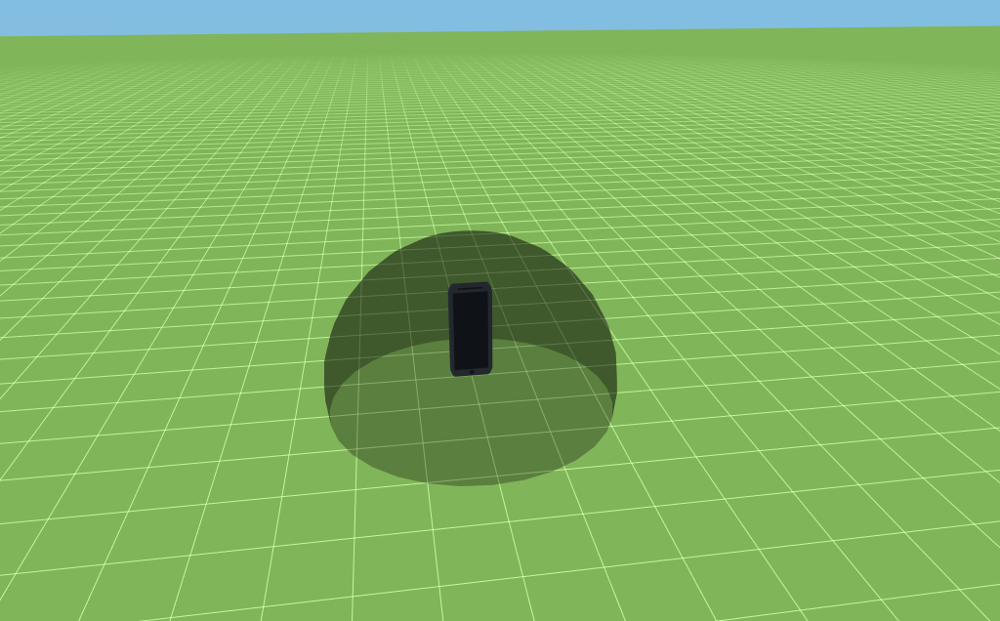

  Transmission bubble starting

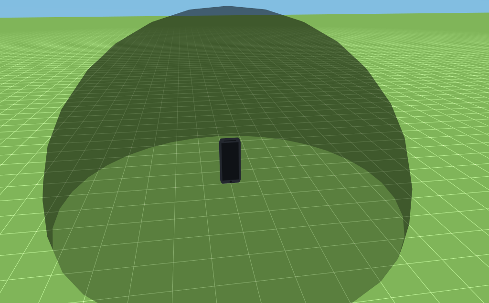

  A transmission in progress

.. raw:: latex

    \clearpage

Motion Trails
^^^^^^^^^^^^^

In the application, the user may opt to see a colored line tracing the
mobility of the ``Node``s in the simulation. By default,
the ``BaseColor``, or ``HighlightColor`` will be used for
the trail's color. If neither of those are set, then
the module will choose the next color in the palette.
The trail color may be set on its own with the
``MotionTrailColor`` attribute.

The motion trail may be toggled for an individual ``Node``
using the ``EnableMotionTrail`` attribute, and setting
the motion trail display option in the application
to "Enabled Only"

  A motion trail following a Node

Attributes
^^^^^^^^^^

+----------------------+---------------------------------------+-----------------+--------------------------------------------------------------+
| Name                 | Type                                  | Default Value   | Description                                                  |
+======================+=======================================+=================+==============================================================+
| Name                 | string                                | n/a             | Name to use for this ``ns3::Node`` in application elements   |
+----------------------+---------------------------------------+-----------------+--------------------------------------------------------------+
| Model                | string                                | n/a             | Relative path from the application's ``Resource``            |
|                      |                                       |                 | directory to the model to show for this ``ns3::Node``        |
+----------------------+---------------------------------------+-----------------+--------------------------------------------------------------+
| Orientation          | Vector3D                              | (0, 0, 0)       | Orientation of the ``ns3::Node`` on each axis, in degrees    |
|                      |                                       |                 | (e.g. vector.x = 90 applies a 90 degree rotation             |
|                      |                                       |                 | on the X axis to the model)                                  |
+----------------------+---------------------------------------+-----------------+--------------------------------------------------------------+
| Scale                | double                                | 1.00            | A multiplicative scale to apply to the model.                |
|                      |                                       |                 | Applied after ``Height``                                     |
|                      |                                       |                 | (e.g. a value of 1.25 will apply a 1.25x scale to the model) |
|                      |                                       |                 | Also see the ``SetScale(float)``/``GetScale()`` methods      |
+----------------------+---------------------------------------+-----------------+--------------------------------------------------------------+
| ScaleAxes            | Vector3D                              | (1.0, 1.0, 1.0) | Similar to ``Scale``, but for each axis. In the order        |
|                      |                                       |                 | ``[x, y, z]``.  Applied after ``Height``                     |
|                      |                                       |                 | (e.g. A value of [1.25, 1, 1] will scale the model up        |
|                      |                                       |                 | by 25% on the X axis, and keep the other axes                |
|                      |                                       |                 | the same size) Also see the                                  |
|                      |                                       |                 | ``SetScale(Vector3D)``/``SetScaleAxes(Vector3D)``/           |
|                      |                                       |                 | ``GetScaleAxes()`` methods                                   |
+----------------------+---------------------------------------+-----------------+--------------------------------------------------------------+
| Offset               | Vector3D                              | (0, 0, 0)       | The amount to 'offset' the rendered model from the           |
|                      |                                       |                 | actual position of the ``ns3::Node``                         |
|                      |                                       |                 | on each axis, in ns-3 units                                  |
+----------------------+---------------------------------------+-----------------+--------------------------------------------------------------+
| KeepRatio            | bool                                  | ``true``        | When scaling with the ``Height``, ``Width``,                 |
|                      |                                       |                 | and ``Depth`` attributes, use only the value that produces   |
|                      |                                       |                 | the largest model. Keeping the scale uniform.                |
+----------------------+---------------------------------------+-----------------+--------------------------------------------------------------+
| Height               | :ref:`optional-value` <double>        | n/a             | Calculates a scale, such that the height of the model        |
|                      |                     |                 |                 | matches this value in ns-3 units. Maintains the aspect       |
|                      |                                       |                 | ratio if  ``KeepRatio`` is ``true`` (The default)            |
|                      |                                       |                 | Applied before ``Scale``                                     |
+----------------------+---------------------------------------+-----------------+--------------------------------------------------------------+
| Width                | :ref:`optional-value` <double>        | n/a             | Calculates a scale, such that the width of the model         |
|                      |                                       |                 | matches this value in ns-3 units. Maintains the aspect       |
|                      |                                       |                 | ratio if  ``KeepRatio`` is ``true`` (The default)            |
|                      |                                       |                 | Applied before ``Scale``                                     |
+----------------------+---------------------------------------+-----------------+--------------------------------------------------------------+
| Depth                | :ref:`optional-value` <double>        | n/a             | Calculates a scale, such that the depth of the model         |
|                      |                                       |                 | matches this value in ns-3 units. Maintains the aspect       |
|                      |                                       |                 | ratio if  ``KeepRatio`` is ``true`` (The default)            |
|                      |                                       |                 | Applied before ``Scale``                                     |
+----------------------+---------------------------------------+-----------------+--------------------------------------------------------------+
| BaseColor            | :ref:`optional-value` <:ref:`color3`> | n/a             | Color to apply to the base coat of models supporting         |
|                      |                                       |                 | configurable colors                                          |
+----------------------+---------------------------------------+-----------------+--------------------------------------------------------------+
| HighlightColor       | :ref:`optional-value` <:ref:`color3`> | n/a             | Color to apply to details of models supporting               |
|                      |                                       |                 | configurable colors                                          |
+----------------------+---------------------------------------+-----------------+--------------------------------------------------------------+
| EnableMotionTrail    | bool                                  | ``false``       | Flag to show/hide the motion trail if the application is     |
|                      |                                       |                 | set to the 'Enabled Only' motion trail mode                  |
+----------------------+---------------------------------------+-----------------+--------------------------------------------------------------+
| MotionTrailColor     | :ref:`optional-value` <:ref:`color3`> | n/a             | The color of the optional motion trail, which follows the    |
|                      |                                       |                 | ``Node`` in the application. If unset, uses ``BaseColor``,   |
|                      |                                       |                 | ``HighlightColor`` , or the next color in the palette        |
|                      |                                       |                 | in that order.                                               |
+----------------------+---------------------------------------+-----------------+--------------------------------------------------------------+
| PositionTolerance    | double                                | 0.05            | The amount a ``ns3::Node`` must move to have it's            |
|                      |                                       |                 | position written again. In ns-3 units.                       |
|                      |                                       |                 | Used only if ``UsePositionTolerance`` is ``true``            |
+----------------------+---------------------------------------+-----------------+--------------------------------------------------------------+
| UsePositionTolerance | bool                                  | ``true``        | Only write positions when the ``ns3::Node`` has              |
|                      |                                       |                 | moved beyond the ``PositionTolerance``                       |
+----------------------+---------------------------------------+-----------------+--------------------------------------------------------------+
| Visible              | bool                                  | ``true``        | Defines if the ``ns3::Node`` is rendered in the application  |
+----------------------+---------------------------------------+-----------------+--------------------------------------------------------------+

