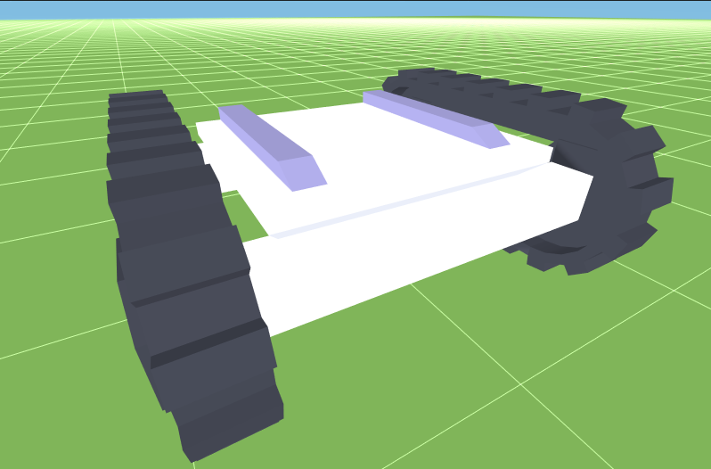
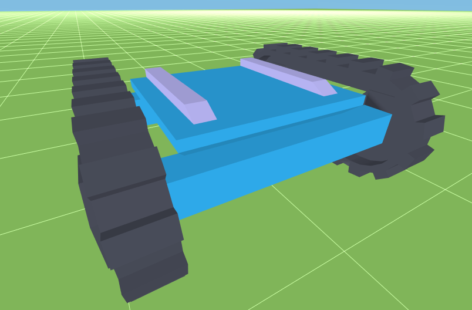
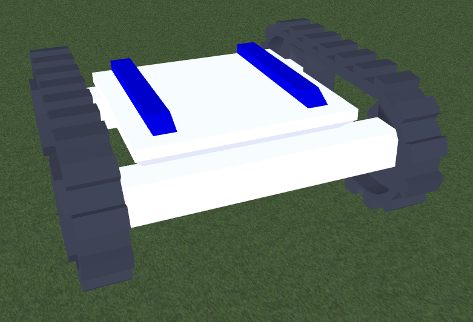

Showing Nodes
=============

To show a ``ns3::Node`` in the application aggregate a ``NodeConfiguration`` onto
it, and define a ``Model`` to use to represent the ``ns3::Node``.

.. _node-configuration:

NodeConfiguration
-----------------

A ``NodeConfiguration`` is used to determine if a ``ns3::Node`` in the scenario
should be displayed in the application. If a ``NodeConfiguration`` was installed on a ``ns3::Node``
then that ``ns3::Node`` will be tracked and shown during playback.

The basic setup for a ``NodeConfiguration`` is as follows:

.. code-block:: C++

  netsimulyzer::NodeConfigurationHelper nodeHelper{/* the orchestrator */};

  nodeHelper.SetAttribute ("Model", StringValue ("path/model.obj"));

  nodeHelper.Install (/* Ptr or Collection */)

.. The images make this section a bit unwieldy, so exert some extra control over the pages
.. raw:: latex

    \clearpage

Configurable Colors
^^^^^^^^^^^^^^^^^^^
Certain models provided with the application allow their colors to be set by the loaded
scenario. An example of configurable colors follows using the "Land Drone" model distributed
with the application

Base Color
++++++++++
The ``BaseColor`` is typically the color which occupies the majority of the surface area
of the model. What follows is an example with the "Land Drone"'s ``BaseColor`` set to blue

Highlight Color
+++++++++++++++
The ``HighlightColor`` is typically the color used to mark details on the model
of the model. What follows is an example with the "Land Drone"'s ``HighlightColor`` set to blue

Mobility Model Integration
^^^^^^^^^^^^^^^^^^^^^^^^^^

The location of the ``ns3::Node`` is read from whatever Mobility Model is aggregated on the same ``ns3::Node``.
If no Mobility Model is aggregated onto a Node, then it will be displayed at the origin (0, 0, 0).

There are two mechanisms for tracking a Node's location:

.. _location-polling:

Location Polling
++++++++++++++++

If the ``PollMobility`` in the :doc:`orchestrator` is ``true``, then each configured ``ns3::Node`` will be
polled for its location based on the ``MobilityPollInterval``.

If ``UsePositionTolerance`` is ``true`` (the default), then the change in the
position of a ``Node`` must be greater than the start written location plus the
``PositionTolerance`` (default 0.05 ns-3 units) to be written again.

See the :ref:`Orchestrator page on Mobility Polling <orchestrator-mobility-polling>` for more details.

CourseChange Callback
+++++++++++++++++++++

Whenever the aggregated Mobility Model emits a ``CourseChange`` trace
the location of the ``ns3::Node`` is written.

Most models only emit these for significant events, such as velocity change, explicit location change,
etc.

Positions written from a ``CourseChange`` callback are not subject to the ``PositionTolerance``
and will always be written.

Unlike :ref:`location-polling`, this location tracing may not be disabled.

Attributes
^^^^^^^^^^

+----------------------+---------------------------------------+---------------+--------------------------------------------------------------+
| Name                 | Type                                  | Default Value | Description                                                  |
+======================+=======================================+===============+==============================================================+
| Name                 | string                                | n/a           | Name to use for this ``ns3::Node`` in application elements   |
+----------------------+---------------------------------------+---------------+--------------------------------------------------------------+
| Model                | string                                | n/a           | Relative path from the application's ``Resource``            |
|                      |                                       |               | directory to the model to show for this ``ns3::Node``        |
+----------------------+---------------------------------------+---------------+--------------------------------------------------------------+
| Orientation          | Vector3D                              | (0, 0, 0)     | Orientation of the ``ns3::Node`` on each axis, in degrees    |
|                      |                                       |               | (e.g. vector.x = 90 applies a 90 degree rotation             |
|                      |                                       |               | on the X axis to the model)                                  |
+----------------------+---------------------------------------+---------------+--------------------------------------------------------------+
| Scale                | double                                | 1.00          | A multiplicative scale to apply to the model.                |
|                      |                                       |               | Applied after ``Height``                                     |
|                      |                                       |               | (e.g. a value of 1.25 will apply a 1.25x scale to the model) |
+----------------------+---------------------------------------+---------------+--------------------------------------------------------------+
| Offset               | Vector3D                              | (0, 0, 0)     | The amount to 'offset' the rendered model from the           |
|                      |                                       |               | actual position of the ``ns3::Node``                         |
|                      |                                       |               | on each axis, in ns-3 units                                  |
+----------------------+---------------------------------------+---------------+--------------------------------------------------------------+
| Height               | :ref:`optional-value` <double>        | n/a           | Desired height of the model in ns-3 units.                   |
|                      |                                       |               | Applied before ``Scale``                                     |
+----------------------+---------------------------------------+---------------+--------------------------------------------------------------+
| BaseColor            | :ref:`optional-value` <:ref:`color3`> | n/a           | Color to apply to the base coat of models supporting         |
|                      |                                       |               | configurable colors                                          |
+----------------------+---------------------------------------+---------------+--------------------------------------------------------------+
| HighlightColor       | :ref:`optional-value` <:ref:`color3`> | n/a           | Color to apply to details of models supporting               |
|                      |                                       |               | configurable colors                                          |
+----------------------+---------------------------------------+---------------+--------------------------------------------------------------+
| PositionTolerance    | double                                | 0.05          | The amount a ``ns3::Node`` must move to have it's            |
|                      |                                       |               | position written again. In ns-3 units.                       |
|                      |                                       |               | Used only if ``UsePositionTolerance`` is ``true``            |
+----------------------+---------------------------------------+---------------+--------------------------------------------------------------+
| UsePositionTolerance | bool                                  | ``true``      | Only write positions when the ``ns3::Node`` has              |
|                      |                                       |               | moved beyond the ``PositionTolerance``                       |
+----------------------+---------------------------------------+---------------+--------------------------------------------------------------+
| Visible              | bool                                  | ``true``      | Defines if the ``ns3::Node`` is rendered in the application  |
+----------------------+---------------------------------------+---------------+--------------------------------------------------------------+

