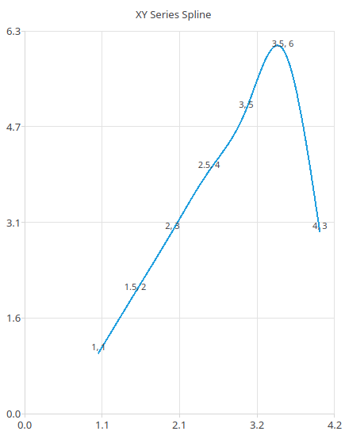
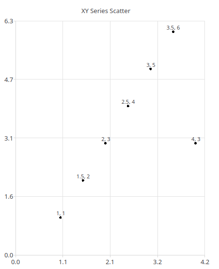

Numeric Data
============

A significant portion of information with may be drawn from *ns-3*
is purely numeric (e.g. throughput over time, signal to noise ratio,
packet loss, etc.). To plot such data use a ``XYSeries``.

.. _xy-series:

XYSeries
--------

XYSeries track data points with two numeric coordinates.

The Series by default connects points with a straight line,
but it may be configured to not connect points and use larger
dots like a scatter plot or using a curved line (spline).
See: the ``Connection`` attribute and
:ref:`xy-connection-types` for more info.

Labels displaying the values of each point are shown by default,
but they may be disabled. See the ``LabelMode`` attribute
for more info.

.. _xy-connection-types:

Connection Types
^^^^^^^^^^^^^^^^
Line
++++
The default connection mode. Creates a graph with each
point connected with a straight line.

.. image:: _static/xy-line.png
  :alt: Line Plot in the Application
  :width: 447px
  :height: 547px

Spline
++++++

Like the ``Line`` mode, but connections curve between points

None
++++

Makes the points slightly larger and draws no connections
between them,

Attributes
----------
+----------------------+--------------------+--------------------+---------------------------------------------------------------+
| Name                 | Type               | Default Value      | Description                                                   |
+======================+====================+====================+===============================================================+
| XAxis                | :ref:`value-axis`  | Default configured | The X Axis shown on the graph                                 |
|                      |                    | :ref:`value-axis`  |                                                               |
+----------------------+--------------------+--------------------+---------------------------------------------------------------+
| YAxis                | :ref:`value-axis`  | Default configured | The Y Axis shown on the graph                                 |
|                      |                    | :ref:`value-axis`  |                                                               |
+----------------------+--------------------+--------------------+---------------------------------------------------------------+
| Connection           | ConnectionType     | Line               | Method of connecting points in the                            |
|                      |                    |                    | application. See :ref:`xy-connection-types`                   |
|                      |                    |                    |                                                               |
|                      |                    |                    | * ``None`` creates a scatter plot                             |
|                      |                    |                    | * ``Line`` connects each point with a straight line           |
|                      |                    |                    | * ``Spline`` connects each point with a curved line           |
+----------------------+--------------------+--------------------+---------------------------------------------------------------+
| LabelMode            | LabelMode          | Shown              | Method to display point labels                                |
|                      |                    |                    |                                                               |
|                      |                    |                    | * ``Shown`` Show labels on each point showing its coordinates |
|                      |                    |                    | * ``Hidden`` Do not show labels on points                     |
|                      |                    |                    |                                                               |
+----------------------+--------------------+--------------------+---------------------------------------------------------------+
| Name                 | string             | "XY Series: {ID}"  | Name to use for this Series in application elements           |
+----------------------+--------------------+--------------------+---------------------------------------------------------------+
| Legend               | string             | Value of ``Name``  | Name for the series that appears in the chart legend.         |
+----------------------+--------------------+--------------------+---------------------------------------------------------------+
| Visible              | bool               | ``true``           | Defines if Series appears in application elements             |
+----------------------+--------------------+--------------------+---------------------------------------------------------------+
| Color                | :ref:`color4`      | n/a                | The color to use for point connections                        |
|                      |                    |                    | (``Line`` & ``Spline``) or the points (``None``)              |
+----------------------+--------------------+--------------------+---------------------------------------------------------------+

