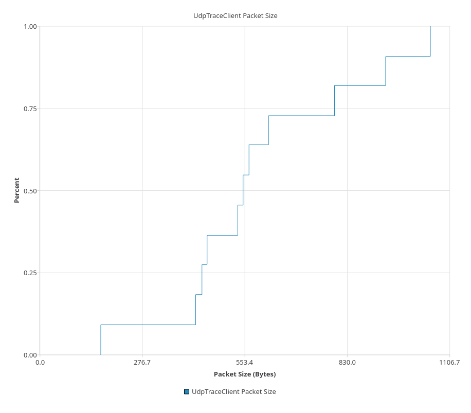
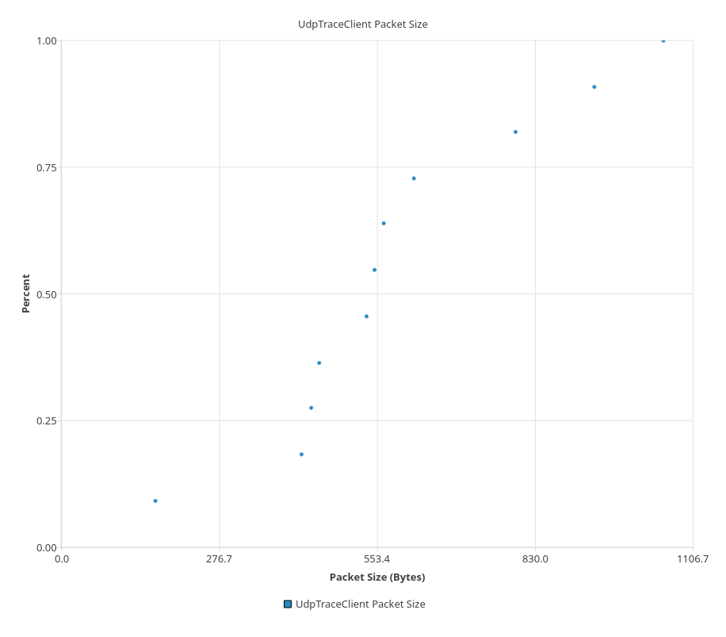

Sinks
=====
To assist with data collection, several helpers which collect common data from
a scenario are provided. These helpers are referred to as 'Sinks', as in 'Trace Sinks'.

ThroughputSink
--------------

The ``ThroughputSink`` tracks data written over a configurable period (defined by the ``Interval`` attribute)
and plots the data on an :ref:`xy-series`.

Connect a generic ``TX`` trace which emit the size of transmitted packets (in bytes)
to ``AddPacketSize``, and the model will collect the amounts over the defined period, then write to the series.

.. code-block:: C++

  auto app = // Something with a `TX` trace like this: `void tx(Ptr<const Packet> packet)`
  auto throughput = CreateObject<netsimulyzer::ThroughputSink>(/* orchestrator */, "Series name");

  // How often to write throughput
  throughput->SetAttribute ("Interval", TimeValue (Seconds(1.0)));

  // Unit to display data in, does not change the values passed to the sink
  throughput->SetAttribute ("Unit", EnumValue (netsimulyzer::ThroughputSink::Unit::KBit));

  // Unit to group time by, does not affect `Interval`
  throughput->SetAttribute ("TimeUnit", EnumValue (Time::Unit::S));

  // Assuming "Tx" = TracedCallback<Ptr<const Packet>>
  app->TraceConnectWithoutContext(
     "Tx", MakeCallback(&netsimulyzer::ThroughputSink::AddPacket, throughput);

See `throughput-sink-example-netsimulyzer.cc` for a more in-depth example.

Attributes
^^^^^^^^^^

+----------+-------------------+----------------+-----------------------------------------------------+
| Name     | Type              | Default Value  | Description                                         |
+==========+===================+================+=====================================================+
| XYSeries | :ref:`xy-series`  | n/a            | The underling series to which data is written,      |
|          |                   |                | also see the ``GetSeries ()`` method                |
+----------+-------------------+----------------+-----------------------------------------------------+
| Interval | Time              | Seconds(1.0)   | How often to cut off and write collected throughput |
+----------+-------------------+----------------+-----------------------------------------------------+
| Unit     | Unit              | KBit           | Unit to display throughput values in.               |
|          |                   |                | Does not affect values passed to ``AddPacketSize``  |
+----------+-------------------+----------------+-----------------------------------------------------+
| TimeUnit | Time::Unit        | Time::S        | Unit to display time values in.                     |
+----------+-------------------+----------------+-----------------------------------------------------+

StateTransitionSink
-------------------

The ``StateTransitionSink`` is attached to a state changed trace for a given model
and graphs the time and to what state the model changes to.

The model must be provided a list of all possible states in advance. States are strings
with optional integer IDs (enum values), as well as the initial state.

The sink may also emit log messages when the state has changed, see the ``LoggingMode`` attribute.

The model expects a trace for state changes in one of the following forms:

.. code-block:: C++

  // String States
  void Model::StateChanged(std::string newState);

  // enum States
  void Model::StateChanged(Model::State newState);
  // Assuming Model::State is an enum of all possible model states

String States
^^^^^^^^^^^^^
For string states, only a vector of possible states is required, as the axis labels
will directly use the possible states.

Connect the model's state changed trace to ``StateTransitionSink::StateChangedName``

.. code-block:: C++

  // Provide a std::vector of possible string states
  const std::vector<std::string> states{"Stopped", "Waiting", "Transmitting"};

  auto stateSink = CreateObject<netsimulyzer::StateTransitionSink> (
    /* orchestrator */,
    states,
    "Stopped" // Initial state the model is in
  );

  // Connect to StateChangedName for string states
  userApp->TraceConnectWithoutContext (
      "StateChanged", // TracedCallback from user model, passing the new state
                      // like so: TracedCallback<const std::string &>
      MakeCallback (&netsimulyzer::StateTransitionSink::StateChangedName,
                    stateSink));

Enum States
^^^^^^^^^^^
For enum based states, a label to use for each state must be provided for display
using a ``ValuePair`` from :ref:`category-axis`.

Connect the model's state changed trace to ``StateTransitionSink::StateChangedId``

.. code-block:: C++

  // ValuePair from CategoryAxis
  // Model::States is an enum of possible states
  // from user provided model
  const std::vector<netsimulyzer::CategoryAxis::ValuePair> states{
    { Model::State::Stopped, "Stopped" },
    { Model::State::Waiting, "Waiting" },
    { Model::State::Transmitting, "Transmitting" }
  };

  auto stateSink = CreateObject<netsimulyzer::StateTransitionSink> (
    /* orchestrator */,
    states,
    Model::States::Stopped // Initial state must be an enum value
  );

  // Connect to StateChangedId for enum states
  userApp->TraceConnectWithoutContext (
      "StateChanged", // TracedCallback from user model, passing the new state
                      // like so: TracedCallback<Model::State>
      MakeCallback (&netsimulyzer::StateTransitionSink::StateChangedId,
                    stateSink));

Attributes
^^^^^^^^^^

+-------------+------------------------------+----------------+---------------------------------------------------------+
| Name        | Type                         | Default Value  | Description                                             |
+==========+=================================+================+=========================================================+
| Name        | string                       | n/a            | Name to use for the ``Series`` and ``Log``              |
+-------------+------------------------------+----------------+---------------------------------------------------------+
| Series      | :ref:`category-value-series` | n/a            | The underling series to which data is written.          |
+-------------+------------------------------+----------------+---------------------------------------------------------+
| Log         | :ref:`log-stream`            | n/a            | The stream messages are written to                      |
+-------------+------------------------------+----------------+---------------------------------------------------------+
| LoggingMode | LoggingMode                  | StateChanges   | Logging behavior of the sink                            |
|             |                              |                |                                                         |
|             |                              |                | * ``All``: Log all possible messages                    |
|             |                              |                | * ``StateChanges``: Only log when a state change occurs |
|             |                              |                | * ``None``: Disable logging and hide the stream         |
+-------------+------------------------------+----------------+---------------------------------------------------------+
| TimeUnit    | Time::Unit                   | Time::S        | Unit to display time values in.                         |
+-------------+------------------------------+----------------+---------------------------------------------------------+

EcdfSink
--------

The ``EcdfSink`` generates a graph of a empirical cumulative distribution function
using an :ref:`xy-series`, based on the data points added to it via ``Append ()``.

The graph may be regenerated every time a point is added (the default), based on an interval,
or manually by calling ``Flush ()``

See `ecdf-sink-example.cc` for an example.

Attributes
^^^^^^^^^^

+----------------------+----------------------------------+--------------------+----------------------------------------------------------------------------------------------------+
| Name                 | Type                             | Default Value      | Description                                                                                        |
+======================+==================================+====================+====================================================================================================+
| Series               | :ref:`xy-series`                 | n/a                | The underling series to which data is written,                                                     |
|                      |                                  |                    | also see the ``GetSeries ()`` method                                                               |
+----------------------+----------------------------------+--------------------+----------------------------------------------------------------------------------------------------+
| Connection           | :ref:`xy-series`::ConnectionType | Line               | Convenience attribute to change the type of generated plot.                                        |
|                      |                                  |                    | See :ref:`xy-connection-types`                                                                     |
|                      |                                  |                    |                                                                                                    |
|                      |                                  |                    | * ``None`` Sows only a point at the given data point and frequency                                 |
|                      |                                  |                    | * ``Line`` Show each value as a 'step' with a horizontal line between data points                  |
|                      |                                  |                    |                                                                                                    |
+----------------------+----------------------------------+--------------------+----------------------------------------------------------------------------------------------------+
| FlushMode            | FlushMode                        | OnWrite            | When to regenerate the plot.                                                                       |
|                      |                                  |                    |                                                                                                    |
|                      |                                  |                    | * ``OnWrite`` Every time a new point is added with ``Append ()``                                   |
|                      |                                  |                    | * ``Interval`` Regenerates the graph after after the time in the ``Interval`` attribute has passed |
|                      |                                  |                    | * ``Manual`` The graph will only regenerate when ``Flush ()`` is called                            |
+----------------------+----------------------------------+--------------------+----------------------------------------------------------------------------------------------------+
| Interval             | Time                             | Seconds(1.0)       | How often to regenerate the plot when using ``Interval`` mode                                      |
+----------------------+----------------------------------+--------------------+----------------------------------------------------------------------------------------------------+
| XAxis                | :ref:`value-axis`                | n/a                | Convenience attribute to access the series X Axis. See: ``GetXAxis ()``                            |
+----------------------+----------------------------------+--------------------+----------------------------------------------------------------------------------------------------+
| YAxis                | :ref:`value-axis`                | n/a                | Convenience attribute to access the series Y Axis. See: ``GetYAxis ()``                            |
+----------------------+----------------------------------+--------------------+----------------------------------------------------------------------------------------------------+

Connection Types
^^^^^^^^^^^^^^^^

Line
++++
The default connection mode. Creates "steps" between each value.

None
++++
Draws points only at the exact value & frequency

